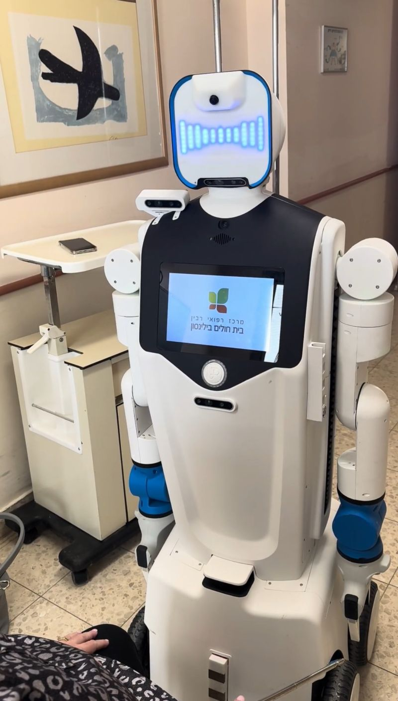

**Role Summary**
- Developed and deployed C++/ROS2 code for field deployments and assisted with debugging to support the team’s success.
- Refactored a major robotics system to improve maintainability and product quality, earning explicit client praise for my collaborative approach and driving noticeable improvements in team delivery since I joined.
- Designed and implemented C++ interfaces to connect embedded hardware with software systems via custom protocols.
- Mentored interns and new team members by providing hands-on guidance and comprehensive onboarding into critical projects.

---

### Notable Projects

#### Implementing C++ and ROS2 Interfaces for Embedded Hardware and IoT Systems 
Designed the architecture and implemented interfaces to connect our embedded hardware with software systems using C++ and ROS2 via custom protocols.

Open Door C++ ROS2 Action:
<video controls width="70%">
  <source src="smart_cart.mp4" type="video/mp4"> alt="Smart Cart in action">
</video>

#### Cognitive Games and Physiotherapy with Geriatric Patients
Developed Python, C++, and ROS2-based applications on Unlimited Robotics' Gary robot, that engaged patients with cognitive games and physiotherapy exercises. Integrated analytics to track patient interactions and progress, enabling data-driven insights for therapists.

  

#### Mentoring Interns at a US Hospital
Was sent abroad to the US to mentor interns and new team members by providing hands-on guidance and comprehensive onboarding into critical projects.

A funny but real case that occurred during my time mentoring US interns at Unlimited Robotics:

[[LinkedIn post] Gary, Unlimited Robotics' robot, in a US hospital](https://www.linkedin.com/posts/guy-altagar_robotics-ai-hospital-activity-7242443754207408130-TMNW?utm_source=share&utm_medium=member_desktop&rcm=ACoAADLieicBijj-HLdtVwSnZav0fE6d9lcysaw)